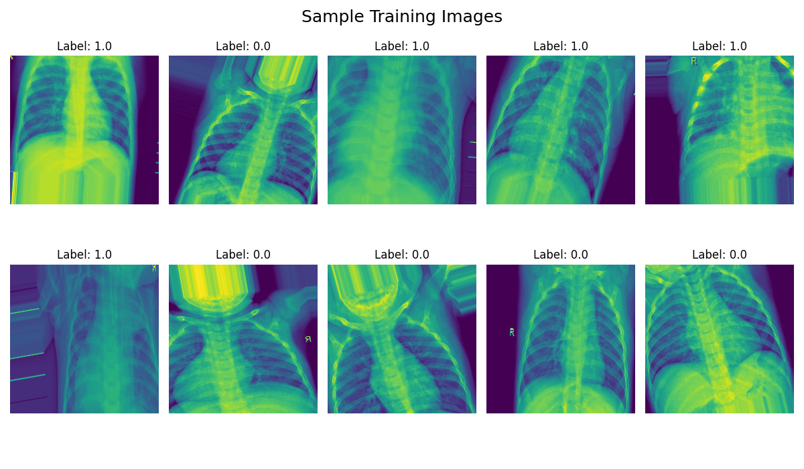

# PNEUMONIA X-RAY DETECTION

## Brief Background on Pneumonia

- Well, for a long time, **Pneumonia** has been the leading cause of death to children under the age of five(under 5 years old).
- There exist a high possibility that pneumonia misdiagnosis leads to more severe cases of Pneumonua thus reducing chances of survival for patients diagnosed with the illness.
- In various reports, including the **World Health Organization** report on Pneumonia in 2017, it is reported that adults with chronic illnesses and those above 65 years are more prone to severe Pneumonia leading to many deaths of this vulnerable groups.
- However, with proper diagnosis and treatment of pneumonia, the chances of survival for a given patient will hence increase thus saving a larger population which would **succumb** to this severe illness.

## Causes of Pneumonia

- There exists no specific causitive agent for pneumonia as various pathogens affecting the lungs may result into pneumonia.
- The causes of pneumonia range from:
  1) Bacterial infections of the lungs.
  2) Viral infections of the lungs.
  3) Fungal infections in the lungs(though rare).

## About the DataSet

- The Dataset contains 5216 train images, 624 test images and 16 test images all belonging to two classes **{Pneumonia, Normal}** which totals to **5856** images.
- We also have randomized patient identification for all the patients.
- The Chest X-Rays are Posterior and Anterior, and have been obtained from retrospective cohorts of pediatric patients between 1 - 5 years old from **Guangzhou Women and Children’s Medical Center, Guangzhou**. However, it should be noted that the effects of pneumonia affect all vulnerable groups of individuals which include adults above 65 years and those living with chronic illnesses.
- For analysis, it is important to note that, all chest radiographs are initially screened for quality control by removing all low quality or unreadable scans. The diagnoses for the images were then graded by two expert physicians before being cleared for training the AI system.
- Be lest assured that our [dataset](https://www.kaggle.com/datasets/paultimothymooney/chest-xray-pneumonia) is clean to use for the training of our model. Thank You👌🦾!

### More About the Dataset?

- [Find it Here!](http://www.cell.com/cell/fulltext/S0092-8674(18)30154-5)

## Brief Data Reporting

- We noted the distribution of the images for the **Train set, Test set and validation set** using a pie chart.

1) **Pie Chart Showing Distribution of Images in The Data Batches**

- It is good to note that in the above pie-chart, Train data has the highest share of the total images, followed by test data with a large margin and validation data tails the list.
- Therefore, from our data, we will have **87.2%** of training images, **10.6%** of test data and **2.1%** of validation data.

2) **Sample Images in the Dataset**

- We can view the posterior and anterior images of the X-ray on the image above.

3) **Showing Metrics and Charts of the Model**

- **Metrics**: Accuracy, Precision, Recall, Specificity and F! Score.
- **Charts**:
  - Train Vs. Validation Loss
  - Training Vs. Validation AUC
  - Confusion Matrix
